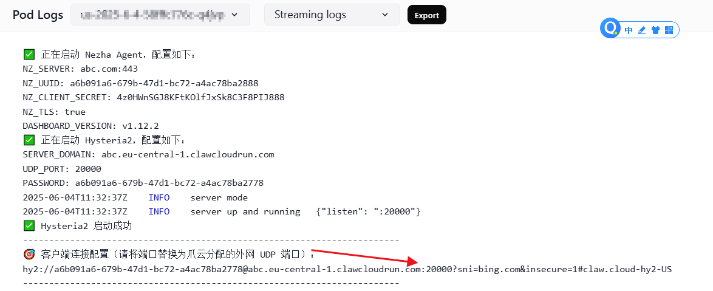

# 这是一个用于claw.cloud部署代理 [Hysteria2 + Nezha Agent](https://github.com/vipmc838/claw-hy2-agent) 的轻量级 Docker 镜像。


## ➡️Claw.Cloud官网(GitHub注册送5美元地址)：[run.claw.cloud](https://console.run.claw.cloud/signin?link=M9P7GXP3M3W5)

## 📦 项目版本说明
- Hysteria2版本 ➡️[Hysteria2](https://github.com/vipmc838/claw-hy2)：基于 UDP 的高速代理，支持 TLS 加密与伪装。
- Nezha Agent版本 ➡️[Nezha Agent](https://github.com/vipmc838/claw-agent)：哪吒监控客户端，连接至哪吒面板进行主机监控。
- 整合版本 ➡️[HY2 Agent](https://github.com/vipmc838/claw-hy2-agent)：Hysteria2 与 Nezha Agent 的集成版，支持一键部署
---

## 🚀 特性

- 使用 Alpine Linux 轻量基础镜像
- 支持环境变量自定义服务端配置
- 自动生成自签 TLS 证书
- 自动从 Gitee 获取指定版本的 Nezha Agent 并启动
- 输出客户端连接字符串，方便快速配置客户端

---
## 📦 Docker 镜像

**镜像地址**：[mc838/claw-hy2-agent](https://hub.docker.com/r/mc838/claw-hy2-agent)

---
## 🛠️ 环境变量说明

| 环境变量            | 说明                         | 示例值                                         |
|---------------------|------------------------------|------------------------------------------------|
| `NZ_SERVER`         | 哪吒面板地址（含端口）       | `abc.com:443`                                  |
| `NZ_UUID`           | 探针的唯一标识UUID（可选，默认自动生成）       | `a6b091a6-679b-47d1-bc72-a4ac78ba2888`       |
| `NZ_CLIENT_SECRET`  | 面板端密钥，用于身份验证     | `4z0HWnSGJ8KFtKOlfJxSk8C3F8PIJ888`            |
| `NZ_TLS`            | 是否启用 TLS（true/false）   | `true`                                         |
| `DASHBOARD_VERSION` | 指定版本（可选，默认最新）   | `v1.12.2`                                      |
| `SERVER_DOMAIN` | 爪云分配的外网域名用于客户端     | `abc.eu-central-1.clawcloudrun.com`    |
| `UDP_PORT`      | 内网 UDP 端口  | `20000-50000`                                 |
| `PASSWORD`      | 客户端密钥，用于身份验证） | `a6b091a6-679b-47d1-bc72-a4ac78ba2778` |

---
## 1. 通过 claw.cloud 部署

1. **Application Name（应用程序名称）**  
   随便填写

2. **Image（镜像地址）**  
```env
mc838/claw-hy2-agent
```
3. **Usage（机器性能配置）**  
   - CPU = 0.1  
   - Memory = 64M

4. **Network（添加网络）**  
   - 网络端口设置：
   - 开启 80 端口 选grpcs://
   - 开启 20000 端口 选udp://
   - 所有端口都选 Public（公网）

5. **Environment Variables（环境变量）**
```env
NZ_SERVER=abc.com:443
NZ_UUID=a6b091a6-679b-47d1-bc72-a4ac78ba2888
NZ_CLIENT_SECRET=4z0HWnSGJ8KFtKOlfJxSk8C3F8PIJ888
NZ_TLS=true
DASHBOARD_VERSION=v1.12.2
SERVER_DOMAIN=abc.eu-central-1.clawcloudrun.com
UDP_PORT=20000
PASSWORD=a6b091a6-679b-47d1-bc72-a4ac78ba2778
```
✅ 设置完成后即可点击部署。

6. **Pod List（客户端连接配置）**  

- 在日志中查看节点信息  
- 示例输出如下：



---
## 鸣谢

- [Hysteria2](https://github.com/HyNetwork/hysteria)
- [哪吒监控 Agent](https://github.com/nezhahq/agent)

---

## 免责声明

- 本程序仅供学习了解，非盈利目的，请于下载后 24 小时内删除，不得用作任何商业用途，文字、数据及图片均有所属版权，如转载须注明来源。  
- 使用本程序必须遵守部署服务器所在地、所在国家和用户所在国家的法律法规，程序作者不对使用者任何不当行为负责。


